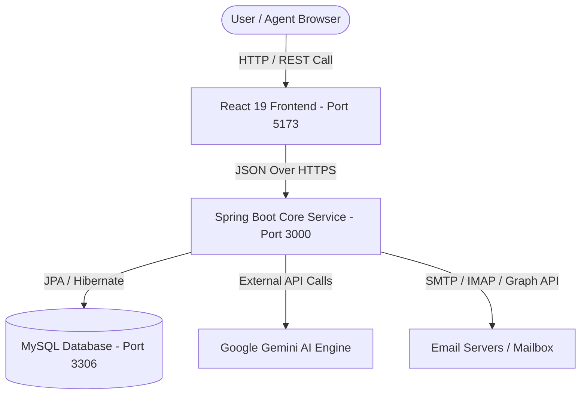
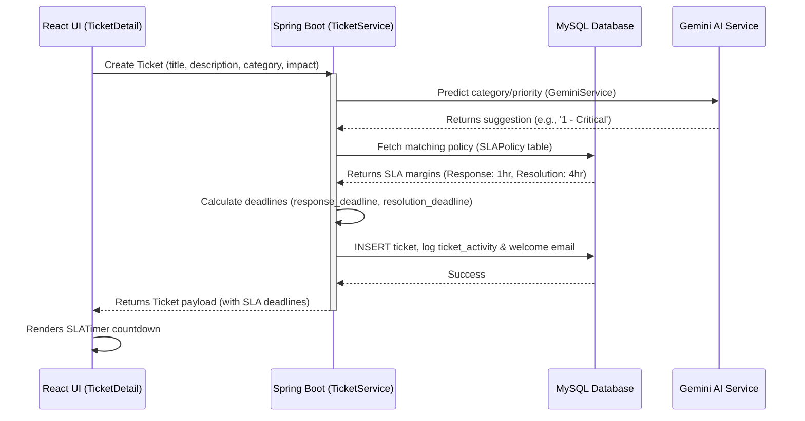

# Ticklora ITSM — Data Structure and Code Structure Documentation

This document provides a comprehensive, verified breakdown of the database data structure (schema) and codebase architecture for **Ticklora** (Manage My Desk), a premium IT Service Management (ITSM) ticketing platform.

---

## 📂 File Finder Directory Mapping Table (For Non-Developers)

Use this table to quickly find files and folders across the project workspace and understand what they do. All path links are clickable.

| File / Folder | Path / Link | Purpose & Description |
| :--- | :--- | :--- |
| **Root Workspace** | [Nexus_Project_Ticket](file:///c:/Users/HP/Downloads/tic%20sys/Nexus_Project_Ticket) | The main folder containing the entire project repository (Frontend, Backend, Database). |
| **Database Schema** | [mysql-schema.sql](file:///c:/Users/HP/Downloads/tic%20sys/Nexus_Project_Ticket/mysql-schema.sql) | Holds the master database table declarations (Users, Tickets, Incidents, SLAs, Kanban tasks). |
| **Database Seed Data** | [mysql-init.sql](file:///c:/Users/HP/Downloads/tic%20sys/Nexus_Project_Ticket/mysql-init.sql) | Seeding script to load default SLA policies, category labels, and initial demo accounts. |
| **System Settings** | [.env](file:///c:/Users/HP/Downloads/tic%20sys/Nexus_Project_Ticket/.env) | Stores database login passwords, port bindings, and external service credentials. |
| **Variables Blueprint** | [# Connect IT - Environment Variables.md](file:///c:/Users/HP/Downloads/tic%20sys/Nexus_Project_Ticket/%23%20Connect%20IT%20-%20Environment%20Variables.md) | Documentation explaining the required environment configurations. |
| **Vite Frontend Root** | [src](file:///c:/Users/HP/Downloads/tic%20sys/Nexus_Project_Ticket/src) | Main frontend folder houses React source files, CSS stylesheets, and client pages. |
| **Frontend Entrypoint** | [index.html](file:///c:/Users/HP/Downloads/tic%20sys/Nexus_Project_Ticket/index.html) | The entry page loaded by the web browser when starting the app. |
| **Application Pages** | [src/pages](file:///c:/Users/HP/Downloads/tic%20sys/Nexus_Project_Ticket/src/pages) | Web pages for each feature module (e.g. Dashboard, Incident list, KB, Standups, Timesheets). |
| **Reusable UI Components** | [src/components](file:///c:/Users/HP/Downloads/tic%20sys/Nexus_Project_Ticket/src/components) | UI widgets like standard buttons, navigation headers, sidebar, AI chat, and SLA visual timers. |
| **TypeScript Types** | [src/types/index.ts](file:///c:/Users/HP/Downloads/tic%20sys/Nexus_Project_Ticket/src/types/index.ts) | Centralized TypeScript interface configurations matching the database models. |
| **Global Theme Styles** | [src/index.css](file:///c:/Users/HP/Downloads/tic%20sys/Nexus_Project_Ticket/src/index.css) | Defines system CSS colors, glassmorphism layouts, and dark mode configuration values. |
| **API Client Connector** | [src/lib/api.ts](file:///c:/Users/HP/Downloads/tic%20sys/Nexus_Project_Ticket/src/lib/api.ts) | Custom API fetch client with built-in token interceptors for communicating with the backend. |
| **State Contexts** | [src/contexts](file:///c:/Users/HP/Downloads/tic%20sys/Nexus_Project_Ticket/src/contexts) | Manages global React states (user authorization, dark theme status, company custom color logos). |
| **Backend Subsystem** | [microservices/core-service-springboot](file:///c:/Users/HP/Downloads/tic%20sys/Nexus_Project_Ticket/microservices/core-service-springboot) | Backend workspace containing Java backend modules (Maven wrappers, Docker settings, etc.). |
| **Java Code Directory** | [core-service-springboot/src/main/java/com/connectit/core](file:///c:/Users/HP/Downloads/tic%20sys/Nexus_Project_Ticket/microservices/core-service-springboot/src/main/java/com/connectit/core) | All backend Java code (Controllers, Services, repositories, SLA breach schedulers). |
| **Backend Config Properties** | [application.properties](file:///c:/Users/HP/Downloads/tic%20sys/Nexus_Project_Ticket/microservices/core-service-springboot/src/main/resources/application.properties) | Profiles parameters and paths defining backend port configurations and database urls. |
| **Main Startup Manual** | [README.md](file:///c:/Users/HP/Downloads/tic%20sys/Nexus_Project_Ticket/README.md) | Explains step-by-step procedures for running backend and frontend local developer servers. |
| **Migration Documentation** | [MIGRATION_GUIDE.md](file:///c:/Users/HP/Downloads/tic%20sys/Nexus_Project_Ticket/MIGRATION_GUIDE.md) | Summary logs detailing structural shifts from Firestore data schemas to MySQL relational tables. |

---

## 🏛️ System Architecture Overview

Ticklora is built using a modern, scalable, and balanced multi-tier architecture:
- **Frontend**: React 19 + TypeScript + Vite + Tailwind CSS v4.
- **Backend**: Spring Boot 3.4.2 (Java 17) + Spring Data JPA + Spring Security.
- **Database**: MySQL 8.0+ for primary persistent storage.
- **Integrations**: Google Gemini AI (for chatbot, automatic classification, and sentiment suggestions) + Microsoft Graph API & IMAP/SMTP (for inbound email parsing and outbound email queues).

### Request Flow


---

## 🗄️ 1. Data Structure (Database Schema)

Ticklora's database schema is designed for performance, auditability, and ITIL compliance. Below are the tables declared in the [mysql-schema.sql](file:///c:/Users/HP/Downloads/tic%20sys/Nexus_Project_Ticket/mysql-schema.sql) file, grouped by logical modules.

### A. User & Session Management
These tables handle user credentials, role-based authorization, session persistence, and custom access control permissions.

#### 1. `users`
*   **Purpose**: Stores user identities, authentication details, contact information, and security roles. Supports backward compatibility with Firebase UIDs.
*   **Columns**:
    *   `id` (BIGINT, PK, Auto-Increment)
    *   `uid` (VARCHAR(128), Unique, Not Null) - Legacy compatibility column preserved for backward compatibility only. Firebase SDK has been fully removed from the project. This column now functions as a unique string identifier only and is not connected to any Firebase service.
    *   `email` (VARCHAR(255), Unique, Not Null) - Primary login handle.
    *   `password_hash` (VARCHAR(255)) - Passwords hashed via Spring Security BCrypt / SimpleHash.
    *   `name` (VARCHAR(255), Not Null) - Display name.
    *   `role` (ENUM('user', 'agent', 'sub_admin', 'admin', 'super_admin', 'ultra_super_admin'))
    *   `phone` (VARCHAR(50))
    *   `department` (VARCHAR(100))
    *   `is_active` (BOOLEAN) - Toggles active status.
    *   `is_demo` (BOOLEAN) - Indicates sandbox account.
    *   `email_verified` (BOOLEAN) - Verification flag.
    *   `photo_url` (TEXT) - Optional profile picture link.
    *   `provider` (VARCHAR(50)) - Authentication provider (email, google, demo).
    *   `created_at` (TIMESTAMP) - Account registration timestamp.
    *   `updated_at` (TIMESTAMP) - Auto-updated on modifications.
    *   `last_login` (TIMESTAMP) - Timestamp of last login request.
    *   `restricted_modules` (TEXT) - JSON-serializable list of restricted page paths.
*   **Indexes**: `idx_email`, `idx_uid`, `idx_role`, `idx_active`

#### 2. `user_sessions`
*   **Purpose**: Manages active user sessions, tokens, and expiration metadata.
*   **Columns**:
    *   `id` (BIGINT, PK, Auto-Increment)
    *   `user_id` (VARCHAR(128), Not Null) - Refers to `users.uid`.
    *   `session_token` (VARCHAR(255), Unique, Not Null) - Auth token.
    *   `ip_address` (VARCHAR(50)) - Remote client IP.
    *   `user_agent` (TEXT) - User browser headers.
    *   `expires_at` (TIMESTAMP) - Expiration deadline.
    *   `created_at` (TIMESTAMP) - Creation time.
    *   `last_activity` (TIMESTAMP) - Last active poll time.
*   **Indexes**: `idx_user_id`, `idx_session_token`, `idx_expires`

#### 3. `company_feature_permissions`
*   **Purpose**: Multi-tenant feature toggle system. Controls which features are enabled/disabled on a per-tenant/company level.
*   **Columns**:
    *   `id` (BIGINT, PK, Auto-Increment)
    *   `company_id` (VARCHAR(128)) - Tenant reference.
    *   `feature_id` (VARCHAR(128)) - ID of toggle feature.
    *   `can_view` / `can_use` / `can_edit` / `is_mandatory` (BOOLEAN) - Feature rules flags.
    *   `status` (VARCHAR(50)) - e.g., 'enabled', 'disabled'.
    *   `updated_by` (VARCHAR(128))
    *   `updated_at` (TIMESTAMP)
*   **Indexes**: Unique index `unique_company_feature` on `(company_id, feature_id)`.

---

### B. Ticketing & Timeline Management
Core ITSM modules tracking the incident lifecycle, support activities, comments, and audit trails.

#### 1. `tickets`
*   **Purpose**: Primary ledger of all incident, service, and change request tickets.
*   **Columns**:
    *   `id` (BIGINT, PK, Auto-Increment)
    *   `ticket_number` (VARCHAR(50), Unique) - e.g., `INC1000001` format.
    *   `caller` / `caller_user_id` / `caller_email` (VARCHAR) - Reporter details.
    *   `affected_user` / `affected_user_id` / `affected_user_email` (VARCHAR) - Affected user details.
    *   `title` (VARCHAR(500), Not Null)
    *   `description` (TEXT)
    *   `category` / `incident_category` / `subcategory` (VARCHAR) - Incident classifications.
    *   `service` / `service_offering` / `cmdb_item` (VARCHAR) - Relates ticket to CMDB models.
    *   `channel` (ENUM('Phone', 'Email', 'Self-service', 'Walk-in', 'Other'))
    *   `status` (ENUM('New', 'In Progress', 'On Hold', 'Resolved', 'Closed', 'Canceled', 'Pending Approval'))
    *   `priority` (ENUM('1 - Critical', '2 - High', '3 - Moderate', '4 - Low'))
    *   `impact` / `urgency` (ENUM('1 - High', '2 - Medium', '3 - Low'))
    *   `assignment_group` (VARCHAR(100)) - Assisting team name.
    *   `assigned_to` / `assigned_to_name` (VARCHAR) - Assigned agent info (references `users.uid`).
    *   `created_by` / `created_by_name` (VARCHAR) - Reporter info (references `users.uid`).
    *   `first_response_at` / `resolved_at` / `closed_at` (TIMESTAMP) - Performance timestamps.
    *   `response_deadline` / `resolution_deadline` (TIMESTAMP) - Calculated based on SLA.
    *   `on_hold_start` / `on_hold_reason` (VARCHAR) - On hold metadata.
    *   `response_sla_status` / `resolution_sla_status` (ENUM('In Progress', 'Completed', 'Breached', 'At Risk'))
    *   `total_paused_time_ms` (BIGINT) - Accumulated time when ticket is set to 'On Hold'.
    *   `points` (INT) - Story points estimation.
    *   `approval_status` (ENUM('Not Required', 'Pending', 'Approved', 'Rejected'))
    *   `reporting_user_email` (VARCHAR(255))
    *   `resolution_code` / `resolution_notes` / `resolution_method` (TEXT)
    *   `closure_reason` (VARCHAR(255))
    *   `company_id` (BIGINT)
    *   `watch_list` (VARCHAR(1000))
    *   `parent_ticket_id` (BIGINT, FK) - Self-referencing link for master-child tickets relation.
*   **Indexes**: `idx_ticket_number`, `idx_status`, `idx_priority`, `idx_assigned_to`, `idx_caller`, `idx_created_at`, `idx_status_priority`, `idx_assigned_status`, `FULLTEXT idx_title_description`

#### 2. `ticket_activities`
*   **Purpose**: Single unified audit timeline containing work notes, system status shifts, incoming/outgoing emails, and integration logs.
*   **Columns**:
    *   `id` (BIGINT, PK, Auto-Increment)
    *   `ticket_id` (BIGINT, FK -> `tickets.id`, Cascade Delete)
    *   `activity_type` (VARCHAR(50)) - e.g., `work_note`, `comment`, `email`, `status_change`, `system`.
    *   `visibility_type` (VARCHAR(50)) - `internal` (agents only) vs `public` (caller visible).
    *   `channel` (VARCHAR(50)) - Portal, email, system.
    *   `message_id` / `thread_id` (VARCHAR(255)) - Email message reference.
    *   `created_by` / `created_by_name` (VARCHAR)
    *   `created_at` (TIMESTAMP)
    *   `message` (TEXT, Not Null) - Core note or event description.
    *   `metadata_json` (JSON) - Custom metadata (e.g., SLA details, email headers).
*   **Indexes**: `idx_ticket_id`, `idx_created_at`, `idx_visibility`

#### 3. `comments`
*   **Purpose**: Backwards-compatible ledger of comments and notes on individual tickets.
*   **Columns**:
    *   `id` (BIGINT, PK, Auto-Increment)
    *   `ticket_id` (BIGINT, FK -> `tickets.id`, Cascade Delete)
    *   `user_id` / `user_name` / `user_role` (VARCHAR)
    *   `message` (TEXT) - Comment text.
    *   `is_internal` (BOOLEAN) - Toggle for internal agent notes.
    *   `created_at` (TIMESTAMP)
    *   `updated_at` (TIMESTAMP)
*   **Indexes**: `idx_ticket_id`, `idx_user_id`, `idx_created_at`

#### 4. `ticket_history`
*   **Purpose**: Log of field value modifications (e.g., assignee changed, priority escalated) for auditing.
*   **Columns**:
    *   `id` (BIGINT, PK, Auto-Increment)
    *   `ticket_id` (BIGINT, FK -> `tickets.id`, Cascade Delete)
    *   `action` (VARCHAR(255)) - e.g., 'Assigned to Database Team'.
    *   `user` / `user_id` (VARCHAR) - Performing user.
    *   `timestamp` (TIMESTAMP)
    *   `details` (TEXT) - Detailed diff.
*   **Indexes**: `idx_ticket_id`, `idx_timestamp`

#### 5. `approvals`
*   **Purpose**: Tracks authorization states for incidents, changes, or service requests requiring administrative clearance.
*   **Columns**:
    *   `id` (BIGINT, PK, Auto-Increment)
    *   `ticket_id` (BIGINT, FK -> `tickets.id`, Cascade Delete)
    *   `status` (ENUM('Pending', 'Approved', 'Rejected'))
    *   `requested_by` / `requested_by_name` (VARCHAR) - Creator.
    *   `approved_by` / `approved_by_name` (VARCHAR) - Approver.
    *   `comments` (TEXT) - Rejection/approval justifications.
    *   `created_at` / `updated_at` (TIMESTAMP)
    *   `approved_at` (TIMESTAMP)
*   **Indexes**: `idx_ticket_id`, `idx_status`, `idx_requested_by`

---

### C. ITIL Processes & SLA Policies
Enforces Service Level Agreements and tracks higher-order ITIL structures (Problems & Change Management).

#### 1. `sla_policies`
*   **Purpose**: Defines SLA rules based on ticket priority and category.
*   **Columns**:
    *   `id` (BIGINT, PK, Auto-Increment)
    *   `name` (VARCHAR(255), Not Null)
    *   `priority` (VARCHAR(50), Not Null)
    *   `category` (VARCHAR(100))
    *   `response_time_hours` / `resolution_time_hours` (INT)
    *   `business_hours_only` / `exclude_weekends` / `exclude_holidays` (BOOLEAN)
    *   `assignment_group` (VARCHAR(100))
    *   `allow_pause` (BOOLEAN) - Pauses timers when ticket status is `On Hold`.
    *   `escalation_levels` (INT) - Number of warning gates.
    *   `is_active` (BOOLEAN)
    *   `description` (TEXT)
    *   `created_at` / `updated_at` (TIMESTAMP)
*   **Indexes**: `idx_priority`, `idx_category`, `idx_active`, Unique index `unique_priority_category`

#### 2. `problems`
*   **Purpose**: Tracks root cause investigations (RCAs) targeting recurring incidents (Problem Management).
*   **Columns**:
    *   `id` (BIGINT, PK, Auto-Increment)
    *   `problem_number` (VARCHAR(50), Unique) - e.g., `PRB10001`.
    *   `title` (VARCHAR(500), Not Null)
    *   `description` (TEXT)
    *   `status` (ENUM('Open', 'Under Investigation', 'Resolved', 'Closed'))
    *   `priority` (ENUM('1 - Critical', '2 - High', '3 - Moderate', '4 - Low'))
    *   `category` (VARCHAR(100))
    *   `root_cause` / `workaround` / `resolution` (TEXT)
    *   `assigned_to` / `assigned_to_name` (VARCHAR)
    *   `reported_by` / `reported_by_name` (VARCHAR)
    *   `related_incidents` (INT)
    *   `created_at` / `updated_at` (TIMESTAMP)
    *   `resolved_at` / `closed_at` (TIMESTAMP)
*   **Indexes**: `idx_problem_number`, `idx_status`, `idx_priority`, `idx_assigned_to`

#### 3. `changes`
*   **Purpose**: Manages Change Requests (Normal, Standard, Emergency) using a controlled CAB approval workflow.
*   **Columns**:
    *   `id` (BIGINT, PK, Auto-Increment)
    *   `change_number` (VARCHAR(50), Unique) - e.g., `CHG10001`.
    *   `title` (VARCHAR(500))
    *   `description` / `risk` / `impact` / `rollback_plan` (TEXT)
    *   `type` (ENUM('Normal', 'Standard', 'Emergency'))
    *   `state` (ENUM('Draft', 'Submitted', 'Planned', 'Approved', 'In Progress', 'Completed', 'Closed', 'Canceled'))
    *   `requester` / `requester_name` (VARCHAR)
    *   `assigned_to` / `assigned_to_name` (VARCHAR)
    *   `planned_start_date` / `planned_end_date` (TIMESTAMP)
    *   `actual_start_date` / `actual_end_date` (TIMESTAMP)
    *   `category` (VARCHAR(100))
    *   `affected_services` (TEXT)
    *   `approval_status` (ENUM('Not Required', 'Pending', 'Approved', 'Rejected'))
    *   `created_at` / `updated_at` (TIMESTAMP)
*   **Indexes**: `idx_change_number`, `idx_type`, `idx_state`, `idx_risk`, `idx_requester`

#### 4. `incident_categories`
*   **Purpose**: Custom classification lookup values for service mapping.
*   **Columns**:
    *   `id` (BIGINT, PK, Auto-Increment)
    *   `name` (VARCHAR(100), Unique, Not Null)
    *   `description` (TEXT)
    *   `status` (ENUM('Active', 'Inactive'))
    *   `created_by` / `created_date` (VARCHAR/TIMESTAMP)
    *   `last_updated_by` / `last_updated_date` (VARCHAR/TIMESTAMP)
*   **Indexes**: `idx_name`, `idx_status`

#### 5. `assets` (CMDB)
*   **Purpose**: Configuration Management Database tracking hardware, software, licenses, and networks.
*   **Columns**:
    *   `id` (BIGINT, PK, Auto-Increment)
    *   `name` (VARCHAR(255), Not Null)
    *   `type` (ENUM('Server', 'Database', 'Network', 'Application', 'Hardware', 'Service'))
    *   `status` (ENUM('Operational', 'Degraded', 'Maintenance', 'Retired'))
    *   `owner` / `owner_name` (VARCHAR)
    *   `location` / `serial_number` / `model` / `manufacturer` (VARCHAR)
    *   `purchase_date` / `warranty_expiry` (DATE)
    *   `ip_address` (VARCHAR(50))
    *   `description` (TEXT)
    *   `created_at` / `updated_at` (TIMESTAMP)
*   **Indexes**: `idx_name`, `idx_type`, `idx_status`, `idx_owner`

#### 6. `knowledge_articles`
*   **Purpose**: Primary portal containing solution guides, standard operating procedures, and troubleshooting articles.
*   **Columns**:
    *   `id` (BIGINT, PK, Auto-Increment)
    *   `article_number` (VARCHAR(50), Unique) - KBxxxxxx format.
    *   `title` (VARCHAR(500), Not Null)
    *   `category` / `subcategory` (VARCHAR)
    *   `content` / `summary` / `tags` (TEXT)
    *   `views` / `rating_count` / `helpful_count` / `not_helpful_count` (INT)
    *   `rating` (DECIMAL)
    *   `author` / `author_name` (VARCHAR)
    *   `reviewer` / `reviewer_name` (VARCHAR)
    *   `status` (ENUM('Draft', 'Published', 'Archived'))
    *   `visibility` (ENUM('Internal', 'Public'))
    *   `version` (INT)
    *   `created_at` / `updated_at` (TIMESTAMP)
    *   `published_at` / `archived_at` (TIMESTAMP)
*   **Indexes**: `idx_article_number`, `idx_category`, `idx_status`, `idx_author`, `FULLTEXT idx_title_content`

---

### D. Group Management & Collaboration
Enables collaborative team boards, standup tracking, project boards, and workload estimation.

#### 1. `settings_groups`
*   **Purpose**: Organizes agents into support/technical teams (e.g., Database Support, Frontend Team).
*   **Columns**:
    *   `id` (VARCHAR(128), PK)
    *   `name` (VARCHAR(255), Not Null)
    *   `description` (TEXT)
    *   `manager_uid` / `manager_name` (VARCHAR)
    *   `assignment_email` (VARCHAR)
    *   `is_active` (TINYINT)
    *   `created_at` / `updated_at` (TIMESTAMP)
    *   `company_id` (VARCHAR(128))

#### 2. `settings_group_members`
*   **Purpose**: Connects users to specific support groups.
*   **Columns**:
    *   `id` (VARCHAR(128), PK)
    *   `user_id` / `user_name` / `user_email` (VARCHAR)
    *   `group_id` (VARCHAR(128), FK references `settings_groups.id` ON DELETE CASCADE)
    *   `role_in_group` (VARCHAR(100))
    *   `is_primary` (TINYINT)
    *   `availability_status` (VARCHAR(20))
    *   `current_workload` (INT)
    *   `skills` (TEXT)
    *   `status` (VARCHAR(20))
    *   `created_by` / `created_at` / `updated_at` (VARCHAR/TIMESTAMP)
    *   `company_id` (VARCHAR(128))

#### 3. Kanban, Standup, and Rating Tables:
*   `groups_tasks`: Kanban dashboard items containing estimated vs actual times, status (`To Do`, `In Progress`, `Review`, `Done`), and due dates.
*   `groups_events`: Deadlines, calendar meetings, dates, and dependencies for group objectives.
*   `groups_plans`: High-level tracking parameters (objective, completion rates, delay rates).
*   `groups_standups`: Logs of daily standups (`yesterday`, `today`, `blockers`) submitted by members.
*   `groups_ratings`: Performance scores across metrics (productivity, Quality, Attendance, etc.).
*   `groups_discussions`: Announcements, threads, and communications posts.
*   `groups_kb`: Group-restricted documentation wikis.
*   `groups_escalations`: Internal queue warning alerts.

---

### E. Integrations & Background Processing

#### 1. `email_queue`
*   **Purpose**: A buffer for outbound transactional notifications and inbound parsed ticket creations.
*   **Columns**:
    *   `id` (BIGINT, PK, Auto-Increment)
    *   `ticket_id` (BIGINT)
    *   `company_id` / `email_integration_id` (INT)
    *   `direction` (ENUM('outbound', 'inbound'))
    *   `recipient` / `subject` (VARCHAR)
    *   `body` (TEXT)
    *   `status` (ENUM('pending', 'processing', 'completed', 'failed'))
    *   `attempts` (INT)
    *   `error_message` (TEXT)
    *   `created_at` / `processed_at` (TIMESTAMP)
*   **Indexes**: `idx_status`, `idx_ticket`

#### 2. `ticket_email_activities`
*   **Purpose**: Log of email transmissions for audit trails.
*   **Columns**:
    *   `id` (BIGINT, PK, Auto-Increment)
    *   `ticket_id` (BIGINT, FK -> `tickets.id` ON DELETE CASCADE)
    *   `direction` (ENUM('inbound', 'outbound'))
    *   `sender` / `recipient` / `subject` (VARCHAR)
    *   `body` (TEXT)
    *   `status` (ENUM('success', 'failed', 'pending'))
    *   `created_at` (TIMESTAMP)

#### 3. `call_logs`, `call_notes`, & `call_activities`
*   **Purpose**: Tracks incoming calls, linking voice desk interactions to ticket entries. Logs duration, transcripts, status, and related incidents.

#### 4. `timesheets` & `time_cards`
*   **Purpose**: Records weekly work hours logged by technicians, specifying tasks, descriptions, and billable ratios.

#### 5. `notifications`
*   **Purpose**: Houses real-time system alerts, approvals updates, assignment pings, and SLA breaches for users.

#### 6. `audit_log`
*   **Purpose**: Stores a JSON differential snapshot (`old_values` vs `new_values`) of entity records for compliance reporting.

#### 7. `system_settings`
*   **Purpose**: Houses core system flags (e.g., ticket sequence counters, maintenance switches, and branding layouts).

---

## ☕ 2. Backend Code Structure (Spring Boot)

The backend service is located inside [microservices/core-service-springboot](file:///c:/Users/HP/Downloads/tic%20sys/Nexus_Project_Ticket/microservices/core-service-springboot). It uses Spring Boot 3.4.2 to handle authorization, notifications scheduling, business validation, and database operations.

```
com.connectit.core/
│
├── CoreServiceApplication.java      # Application bootstrap class
│
├── config/                          # Configuration beans
│   ├── DataSourceConfig.java        # DB setup (configures MySQL database connection pool)
│   ├── SecurityConfig.java          # Spring Security authorization, CORS, and BCrypt password encryption
│   ├── JwtAuthenticationFilter.java  # Intercepts incoming JWT headers to populate security context
│   ├── JwtUtil.java                 # Token issuer, validator, and parsing utility
│   └── DatabaseSeeder.java          # Seeds defaults (SLA matrix guidelines, system parameters)
│
├── exception/                       # Custom exceptions and global handlers
│   ├── GlobalExceptionHandler.java  # Catches system exceptions and formats JSON responses
│   ├── ResourceNotFoundException.java# Thrown when a queried entity is missing from the database
│   └── UnauthorizedException.java   # Thrown when a user attempts privileged operations without access
│
├── controller/                      # REST Endpoints mapping REST requests
│   ├── AuthController.java          # Login, Register, validation endpoints
│   ├── UserController.java          # Role alterations, profile views, path settings updates
│   ├── TicketController.java        # Incident creation, queue re-assignments, closures, approvals
│   ├── SlaController.java           # SLA matrix query endpoints
│   ├── TimesheetController.java     # Timesheet status upgrades, timesheet log submissions
│   ├── CallController.java          # Call logging and call ticket attachments
│   ├── MasterController.java        # Performs generic metadata reflect queries and schemas lookup
│   ├── SettingsController.java      # Controls branding logo payload transfers and system preferences
│   ├── DocumentController.java      # Attachment file uploads and transfers
│   ├── EmailController.java         # Connection checks for IMAP/SMTP mailboxes
│   ├── DashboardController.java     # Feeds SLA compliance statistics and charts
│   ├── DashboardLayoutController.java# Stores personalized dashboards widgets settings
│   ├── MeetingController.java       # Coordinates calendar reservations
│   ├── TSMeetingController.java     # Team standby conference room socket signals
│   ├── NotificationController.java  # Marks system alert logs as read
│   ├── PlanningController.java      # Performs points forecasting and team backlog tasks estimations
│   ├── AiActivityController.java    # Screen capture inputs logs processing
│   ├── AiAssistantController.java   # Google Gemini classification predictions triggers
│   ├── DatabaseAdminController.java # Diagnostic database check routines
│   ├── CompanyController.java       # Manages tenant profiles and metadata
│   └── ViewController.java          # Dynamic user ticket queries filters
│
├── dto/                             # Data Transfer Objects
│   ├── request/                     # Deserialized payloads (e.g., TicketCreateRequest)
│   └── response/                    # Serialized payloads (e.g., TicketDetailsResponse)
│
├── model/                           # JPA Entities mapping to MySQL Database
│   ├── User.java                    # Maps to 'users' table
│   ├── Ticket.java                  # Maps to 'tickets' table
│   ├── TicketActivity.java          # Maps to 'ticket_activities' table
│   ├── Comment.java                 # Maps to 'comments' table
│   ├── Approval.java                # Maps to 'approvals' table
│   ├── Asset.java                   # Maps to 'assets' table
│   ├── SLAPolicy.java               # Maps to 'sla_policies' table
│   ├── SLABreach.java               # Maps to 'sla_breaches' table (warning/breach instances)
│   ├── TimeCard.java                # Maps to 'time_cards' table
│   ├── Timesheet.java               # Maps to 'timesheets' table
│   ├── CallLog.java                 # Maps to 'call_logs' table
│   ├── CallNote.java                # Maps to 'call_notes' table
│   ├── CallActivity.java            # Maps to 'call_activities' table
│   ├── Notification.java            # Maps to 'notifications' table
│   ├── AssignmentGroup.java         # Maps to technical assignment queues
│   ├── Category.java                # Lookup category definitions
│   ├── CompanyEmailConfig.java      # Stores outbound configuration models
│   ├── Department.java              # Department classifications
│   ├── EmailLog.java                # Database trace logs for inbound/outbound emails
│   ├── MessageHistory.java          # Context buffer messages
│   ├── NotificationQueue.java       # Queue logs
│   ├── Role.java                    # Enum roles definition
│   └── TicketCustomField.java       # Extensible schema parameters
│
├── repository/                      # JPA Data query operations interfaces
│   ├── UserRepository.java          # Fetch user by Email, UID
│   ├── TicketRepository.java        # Find tickets by assignee, status, caller, SLA status
│   ├── SLAPolicyRepository.java     # Resolve SLA policy thresholds by priority & category
│   └── ...                          # Standard JPA repositories matching model files
│
├── service/                         # Central Business Logic orchestrators
│   ├── TicketService.java           # Assigns ticket number, resolves priority, calculates SLA metrics
│   ├── UserService.java             # Admin user profiles updates and database registrations
│   ├── SlaService.java              # Triggers warning and breach updates
│   ├── EmailService.java            # Formulates outbound transactional messages, SMTP handler
│   ├── InboundEmailService.java     # Poller logging into IMAP box, parsing body to incidents
│   ├── GeminiService.java           # Prompt builder communicating with Google NLP API
│   ├── CallService.java             # Formats phone notes logs audits
│   └── DatabaseAdminService.java    # Database connectivity verification routines
│
├── scheduler/                       # Background Automation
│   └── SlaScheduler.java            # Periodically processes SLA breaches & warning notifications
│
└── util/                            # Backend Helper classes
    ├── DbUtil.java                  # Dynamic query and system helpers
    └── SimpleHash.java              # Legacy MD5/SHA password hashing fallback
```

---

## ⚛️ 3. Frontend Code Structure (React 19)

The React 19 frontend compiles via Vite and styles using Tailwind CSS v4 variables. The source code resides in the [src](file:///c:/Users/HP/Downloads/tic%20sys/Nexus_Project_Ticket/src) folder.

```
src/
├── main.tsx                         # Core application bootstrap
├── App.tsx                          # Router mappings (React Router v7) and Context providers
├── index.css                        # Styling (Tailwind imports & global dynamic CSS variables)
│
├── pages/                           # Main routes views
│   ├── Login.tsx / Register.tsx     # Session entry portals
│   ├── Dashboard.tsx / MyDashboard.tsx # Incident charts, SLA compliance widgets
│   ├── Tickets.tsx / TicketDetail.tsx # Incident data logs workspace
│   ├── ServicePortal.tsx            # End-user self-service incident registration portal
│   ├── ServiceCatalog.tsx           # Category portal for requests selection
│   ├── CMDB.tsx                     # Configuration items directory view
│   ├── ProblemManagement.tsx        # Problem investigation log files
│   ├── ChangeManagement.tsx         # Change schedule and approval pipeline
│   ├── KnowledgeBase.tsx            # Articles directory with search filters
│   ├── Groups.tsx                   # Teams Kanban dashboard space
│   ├── Calendar.tsx                 # Team calendar showing tasks and changes
│   ├── CreateMeeting.tsx            # Scheduled meetings reservation form
│   ├── MeetingManagement.tsx        # Calendar reservations view
│   ├── TSMeetingLobby.tsx           # Standup video chat lounge room
│   ├── TSMeetingRoom.tsx            # Collaborative RTC team standup room
│   ├── Timesheet.tsx                # Technical hours log portal
│   ├── TimesheetApprovals.tsx       # Manager timesheet reviews
│   ├── AccessControl.tsx            # Routes configurations and permission restrictions
│   ├── ActivityTracker.tsx          # Agent sessions active monitors dashboard
│   ├── Companies.tsx                # Tenant systems config portal
│   ├── EmailIntegrations.tsx        # Mailboxes SMTP/IMAP credentials manager
│   ├── SLAManagementPremium.tsx     # SLA grid criteria settings configurations
│   ├── Approvals.tsx                # Approval tracking lists
│   ├── ApprovedTickets.tsx          # History log for approved change requests
│   ├── BrandingSettings.tsx         # Layout customization portal
│   ├── ClearUsers.tsx               # Session utility tools
│   ├── Conversations.tsx            # Integrated chatbot dialogs
│   ├── DataAnalytics.tsx            # Aggregated performance dashboard
│   ├── DatabaseViewer.tsx           # Developer query debugger tool
│   ├── ForecastingPlanning.tsx      # Planning and backlog point forecast page
│   ├── GlobalHistory.tsx            # Site-wide chronological audit tracker
│   ├── GlobalSearch.tsx             # Fulltext site searching module
│   ├── IncidentCategoryManagement.tsx # Categorization settings panel
│   ├── Leaderboard.tsx              # Employee gamification and rating boards
│   ├── Reports.tsx                  # Custom PDF/CSV ticket reporting portal
│   ├── SLAManagement.tsx            # Legacy SLA limits setups
│   ├── TimesheetReports.tsx         # Technical hour timesheet reports
│   ├── TimesheetWeekly.tsx          # Grid for logging hours
│   ├── Users.tsx                    # Profiles manager dashboard
│   ├── ai/
│   │   └── AIAssistant.tsx          # Kiru AI classification dashboard
│   └── calls/
│       ├── CallLogs.tsx             # Incidents call tracking dashboard
│       ├── CallDetail.tsx           # Single call details and transcripts
│       └── CreateCall.tsx           # Active call logging sheet
│
├── components/                      # Shared reusable UI elements
│   ├── AppNavbar.tsx                # Main portal header dashboard banner
│   ├── Sidebar.tsx                  # Core side workspace layout navigator
│   ├── AIChatbot.tsx                # Kiru chatbot floating widget
│   ├── AITrackerPet.tsx             # Interactive helper screen pet
│   ├── SLATimer.tsx                 # Incident deadline tracker countdown visualizer
│   ├── WorkNotesChat.tsx            # Incident details conversation timeline
│   ├── CustomizableDashboard.tsx    # Drag-and-drop dashboard planner grid
│   ├── SLADelayDialog.tsx           # SLA warning banner dialog
│   ├── AccessRestricted.tsx         # Permissions lock banner screen
│   ├── ActivityCard.tsx             # Monitored active user screens widgets
│   ├── ActivityTimeline.tsx         # History event logs
│   ├── AnalyticsCard.tsx            # High level metrics panels
│   ├── AnalyticsChart.tsx           # Graphic chart components
│   ├── CodexPet.tsx                 # Alternative desktop helper pet
│   ├── CompanyForm.tsx              # Tenant configurations model sheet
│   ├── ContextMenu.tsx              # Custom interactive menu
│   ├── CustomerStories.tsx          # Carousel templates
│   ├── DynamicTypography.tsx        # Styled typography modules
│   ├── EmailActivityCard.tsx        # Card tracking email states
│   ├── ErrorBoundary.tsx            # Standard react error boundary wrapper
│   ├── FeatureGrid.tsx              # Feature options mapping grid
│   ├── Footer.tsx                   # Footer layout
│   ├── GetStartedModal.tsx          # Initial loading wizard
│   ├── MyTasksList.tsx              # Technical task cards
│   ├── Navbar.tsx                   # Navigation bar
│   ├── PerformanceMetric.tsx        # Compliance statistics
│   ├── QuickActions.tsx             # Speed dial tasks buttons
│   ├── RecentActivityList.tsx       # Live alerts dashboard
│   ├── SaveActivityModal.tsx        # Session save validation modal
│   ├── SystemActivityCard.tsx       # Audit engine events log card
│   ├── TabContentMapper.tsx         # Dynamic grid mapper
│   ├── TechnosprintPet.tsx          # Gamification pet layout
│   ├── TypographySettings.tsx       # Accessibility text preferences
│   ├── WorkspaceLayout.tsx          # Base shell layout wrapper
│   └── ui/                          # Radix / Shadcn UI primitive widgets
│       ├── accordion.tsx
│       ├── badge.tsx
│       ├── button.tsx
│       ├── card.tsx
│       ├── dialog.tsx
│       ├── dropdown-menu.tsx
│       ├── input.tsx
│       ├── label.tsx
│       ├── navigation-menu.tsx
│       ├── sheet.tsx
│       └── skeleton.tsx
│
├── contexts/                        # Shared global state management providers
│   ├── AuthContext.tsx              # User details cache, login actions, token stores
│   ├── TicketsContext.tsx           # Incident caches and loading routines
│   ├── BrandingContext.tsx          # Dynamically injected CSS variables for company logos/colors
│   ├── ThemeContext.tsx             # Dark / Light theme variables
│   └── ActivityTrackerContext.tsx   # Tracks active background session screen captures
│
├── hooks/                           # Custom React hooks
│   └── useTSMeeting.ts              # WebRTC standup conference signaling hook
│
├── lib/                             # Utility classes and engines core helpers
│   ├── api.ts                       # Pure Axios HTTP client with JWT Bearer token interceptor only — zero Firebase references
│   ├── activityCapture.ts           # Keeps track of key activities and focus page captures
│   ├── aiEngine.ts                  # Suggestion builder and classifications utility
│   ├── createIncidentFeatures.ts    # Forms configurations defaults mapping
│   ├── dashboardUtils.ts            # Computes incident feed telemetry parameters
│   ├── itServiceCatalogDefaults.ts  # Catalog categories profiles seeder defaults
│   ├── omniChannelEngine.ts         # Coordinates external communication payloads
│   ├── roles.ts                     # Constant access control role mapping guidelines
│   ├── screenshotCapture.ts         # Screen compilation using html2canvas
│   ├── seed.ts                      # Populates client mockups caches
│   ├── serviceCatalog.ts            # Service portal classification groups query hooks
│   ├── slaEngine.ts                 # SLA calculation engine and compliance monitoring
│   ├── speechToEnglish.ts           # Audio recording translator utility
│   ├── utils.ts                     # ClassName joins and formatting utilities
│   └── workSessionAI.ts             # Tracks background sessions logs using GenAI
└── vite-env.d.ts                    # Ambient typing rules for import.meta.env
```

---

## 🔄 4. Key Relationships and Business Flow

### SLA Assessment Lifecycle
When a ticket is created or updated, the system evaluates SLA thresholds automatically.



---

## 🛠️ 5. Key System Automation (Background Tasks)

The backend automates critical ITIL functions via scheduled Spring Boot CRON tasks located in [SlaScheduler.java](file:///c:/Users/HP/Downloads/tic%20sys/Nexus_Project_Ticket/microservices/core-service-springboot/src/main/java/com/connectit/core/scheduler/SlaScheduler.java):

1. **SLA Warning Evaluation**:
   * **Frequency**: Every 15 minutes (`0 */15 * * * *`).
   * **Logic**: Evaluates open tickets with `In Progress` status. If the remaining time falls below 75% or 90% of the SLA policy, the scheduler shifts status to `At Risk`, triggers a browser notification, and logs a warning audit event.
2. **SLA Breach Execution**:
   * **Frequency**: Every hour (`0 0 * * * *`).
   * **Logic**: Queries tickets where `resolution_deadline` is in the past. Automatically marks the status as `Breached`, writes to the `sla_breaches` audit ledger, and emails the designated assignment group manager.
3. **Outbound Email Dispatch**:
   * **Frequency**: Continuous worker.
   * **Logic**: Iterates over the `email_queue` database buffer, dispatching transactional notices using SMTP/Brevo channels, marking items as `completed` or logging trace errors on `failed` attempts.
